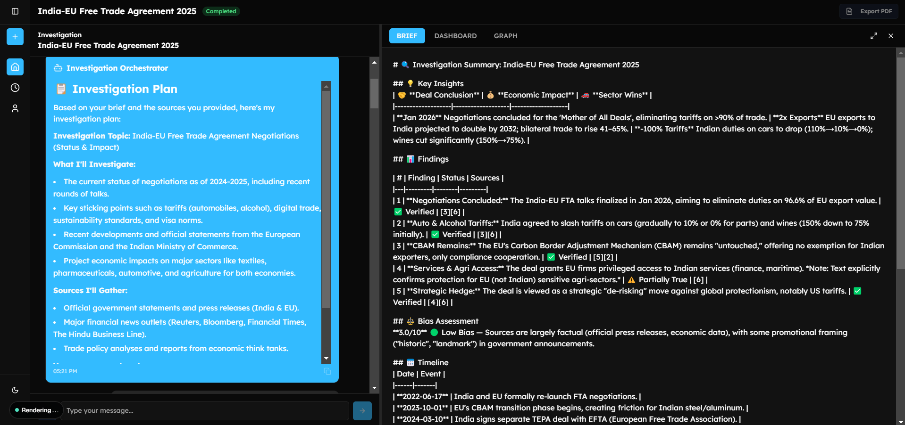
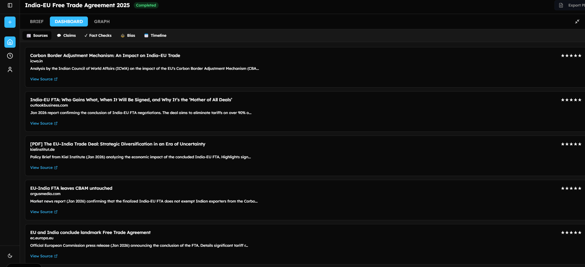
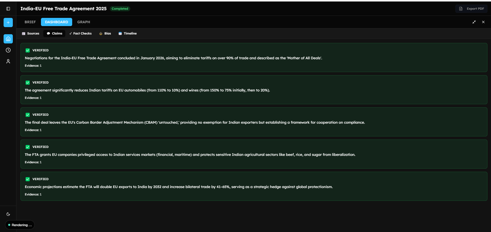
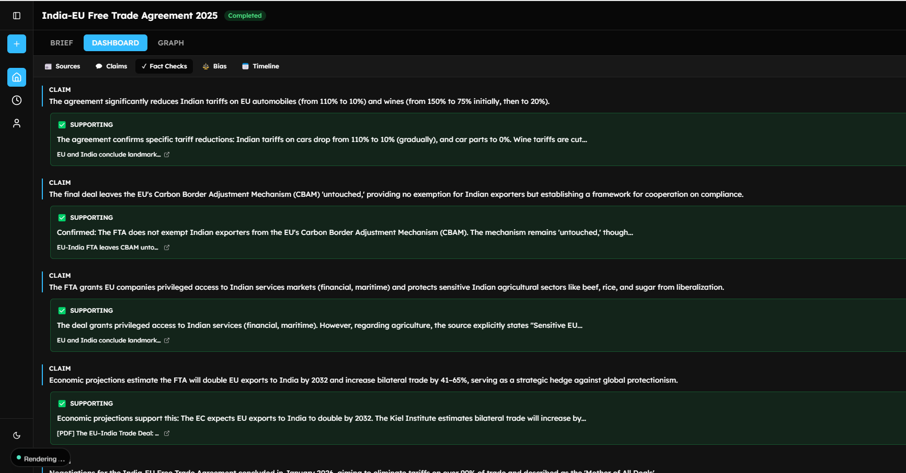
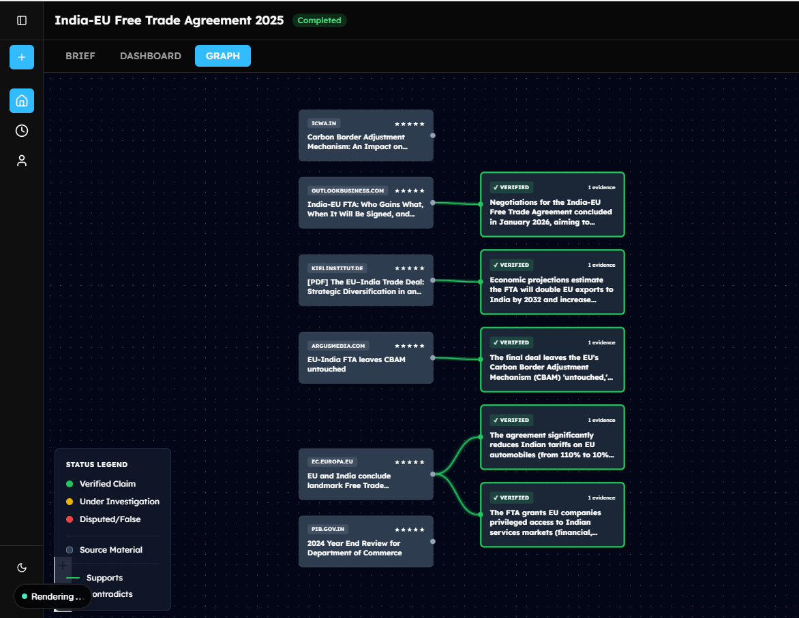
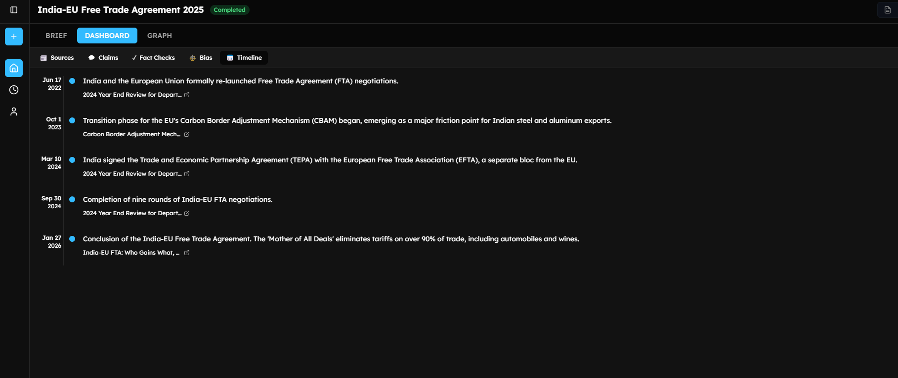

# Vicaran 🕵️‍♂️

**An AI-powered investigative research assistant for journalists.**

[](https://nextjs.org/)
[](https://deepmind.google/technologies/gemini/)
[](https://cloud.google.com/agents)
[](https://opensource.org/licenses/MIT)

> **"Vicaran automates the heavy lifting of initial research—sourcing, claim extraction, and timeline building—so you can focus on the story."**

---

## 🎥 Demo

[](https://youtu.be/YOUR_VIDEO_ID_HERE)

*(Click to watch the 3-minute walkthrough)*

---

## 🚀 Features

Vicaran orchestrates **6 specialized AI agents** to perform deep OSINT research in minutes:

- **🕵️‍♂️ Source Discovery:** Scans the web for relevant articles & reports, scoring each for credibility manually context.
- **✅ Auto-Fact Checking:** Extracts key claims and verifies them against other sources in the dataset (preventing hallucinations).
- **📅 Timeline Builder:** Automatically constructs a chronological timeline of events from scattered reports.
- **⚖️ Bias Analysis:** Detects political lean and emotional language in source reporting.
- **📊 Knowledge Graph:** Visualizes connections between sources, claims, and entities.

---

## 📸 Screenshots

### 1. Investigation Workflow
| **Chat Brief & Plan** | **Sources Discovery** |
|:---------------------------:|:-------------------:|
|  |  |
| *Orchestrator plans the research* | *Agent finds & scores sources* |

### 2. Deep Analysis
| **Claim Extraction** | **Fact Checking** |
|:---------------------------:|:-------------------:|
|  |  |
| *Extracting key claims* | *Verifying against evidence* |

### 3. Visualizations
| **Knowledge Graph** | **Timeline View** |
|:-----------------:|:----------------:|
|  |  |
| *Visualizing connections* | *Chronological events* |

---

## 🏗️ Architecture

Vicaran uses a multi-agent system built with the **Google Agent Development Kit (ADK)**:

```
User Request
    │
    ▼
🤖 Orchestrator ───► 📝 Research Plan
                            │
                            ▼
                    🕵️‍♂️ Source Finder
             (Finds, Reads & Scores Sources)
                            │
                            ▼
                    📝 Claim Extractor
                  (Extracts Factual Claims)
                            │
          ┌─────────────────┼─────────────────┐
          │                 │                 │
   ✅ Fact Checker    ⚖️ Bias Analyzer   📅 Timeline Builder
    (Verifies Claims)   (Scores Bias)    (Extracts Events)
          │                 │                 │
          └─────────────────┼─────────────────┘
                            │
                            ▼
                     📄 Summary Writer
                   (Compiles Final It)
```

### The Workflow:
1.  **Plan:** Orchestrator analyzes the topic and creates a research strategy.
2.  **Gather:** Source Finder searches Tavily, reads content via Jina, and scores credibility.
3.  **Verify:** Claim Extractor pulls facts; Fact Checker cross-references them.
4.  **Synthesize:** Summary Writer compiles the findings into a cited report.

---

## 📁 Project Structure

```
.
├── apps/
│   ├── vicaran-agent/           # 🧠 Python AI Backend (ADK + Gemini)
│   │   ├── vicaran_agent/       # Agent logic & tools
│   │   ├── main.py              # Entry point
│   │   └── requirements.txt     # Python dependencies
│   │
│   └── web/                     # 💻 Next.js Frontend
│       ├── app/                 # App Router pages
│       ├── components/          # React components (Dashboard, Canvas)
│       ├── lib/                 # Utilities & database schema
│       └── public/              # Static assets
└── ...
```

---

## 🛠️ Tech Stack

- **Frontend:** Next.js 15 (App Router), Tailwind CSS, Shadcn UI
- **AI Backend:** Python 3.11, Google ADK, Gemini 3 Pro
- **Database:** Supabase (PostgreSQL), Drizzle ORM
- **Tools:** Tavily (Search), Jina Reader (Scraping)

---

## ⚡ Getting Started

### Prerequisites
- Python 3.11+
- Node.js 18+
- Supabase Project
- API Keys: `GOOGLE_API_KEY`, `TAVILY_API_KEY`, `JINA_API_KEY`

### Installation

1.  **Clone the repo**
    ```bash
    git clone https://github.com/lijohnreddy/vicaran.git
    cd vicaran
    ```

2.  **Backend Setup (Python)**
    ```bash
    cd apps/vicaran-agent
    python -m venv venv
    source venv/bin/activate  # or venv\Scripts\activate on Windows
    pip install -r requirements.txt
    cp .env.example .env      # Add your API keys
    python main.py
    ```

3.  **Frontend Setup (Next.js)**
    ```bash
    cd apps/web
    npm install
    cp .env.example .env.local # Add Supabase keys
    npm run dev
    ```

4.  **Open Browser**
    Go to `http://localhost:3000` to start investigating!

---


## 📄 License

MIT License © 2026 Lijohn Reddy
