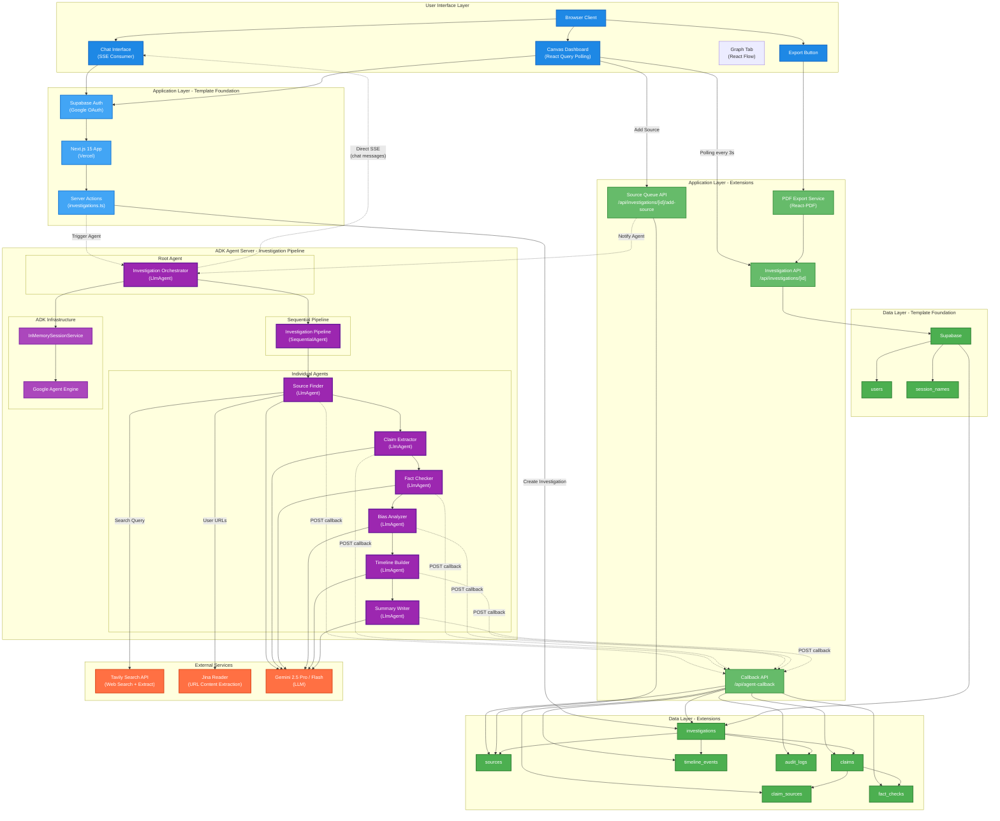

# System Architecture Blueprint

## App Summary
**End Goal:** Help journalists investigate stories faster with AI-powered research
**Template Foundation:** ADK-Agent-SaaS (Next.js 15 + Supabase + Python ADK Server)
**Required Extensions:** Tavily Search API, Jina Reader, PDF Generation, React Flow (Graph Visualization)

---

## 🏗️ System Architecture

### Template Foundation
**Your Chosen Template:** ADK-Agent-SaaS

**Built-in Capabilities:**
- Next.js 15 App Router with Server Actions
- Supabase Auth (Google OAuth)
- PostgreSQL Database (Supabase)
- Python ADK Server on Cloud Run
- SSE streaming infrastructure
- Session management

### Architecture Diagram



---

## 📡 Data Flow Patterns

### Pattern 1: Direct SSE (Chat Messages)
```
ADK Agent → SSE Stream → Browser (Chat UI)
```
- Real-time chat messages displayed instantly
- Progress updates ("Searching for sources...")
- Agent thinking/working status
- No Next.js proxy overhead

### Pattern 2: Callback API (Structured Data)
```
ADK Agent → POST /api/agent-callback → Next.js → PostgreSQL
```
- Sources, claims, fact-checks saved to DB
- Type-safe callback interface
- Single endpoint handles all data types

**Callback Types:**
```typescript
type CallbackType = 
  | 'SOURCE_FOUND'
  | 'CLAIM_EXTRACTED'
  | 'FACT_CHECKED'
  | 'BIAS_ANALYZED'
  | 'TIMELINE_EVENT'
  | 'SUMMARY_UPDATED'
  | 'INVESTIGATION_COMPLETE'
  | 'INVESTIGATION_FAILED';
```

### Pattern 3: Canvas Polling (UI Updates)
```
Browser → GET /api/investigations/[id] → Next.js → PostgreSQL → Response
```
- React Query with 3-second refetch interval
- Fetches structured data for Dashboard tabs
- Separate from real-time chat stream

### Pattern 4: Source Queue (Mid-Investigation)
```
User → Add Source → POST /api/investigations/[id]/add-source → DB → Notify Agent
```
- User-provided sources saved immediately
- Agent picks up new sources on next iteration
- Priority: user sources analyzed first

---

## 🤖 Agent Pipeline Structure

### Sequential Pipeline (6 Agents)

```
RootAgent (Orchestrator)
    │
    ▼
┌─────────────────────────────────────────────────────────────┐
│                  SequentialAgent Pipeline                    │
│                                                              │
│  ┌──────────────┐    ┌──────────────┐    ┌──────────────┐  │
│  │SourceFinder  │───►│ClaimExtractor│───►│ FactChecker  │  │
│  │  (LlmAgent)  │    │  (LlmAgent)  │    │  (LlmAgent)  │  │
│  └──────────────┘    └──────────────┘    └──────────────┘  │
│          │                   │                   │          │
│          ▼                   ▼                   ▼          │
│     Callback API       Callback API       Callback API      │
│                                                              │
│  ┌──────────────┐    ┌──────────────┐    ┌──────────────┐  │
│  │BiasAnalyzer  │───►│TimelineBuilder───►│SummaryWriter │  │
│  │  (LlmAgent)  │    │  (LlmAgent)  │    │  (LlmAgent)  │  │
│  └──────────────┘    └──────────────┘    └──────────────┘  │
│          │                   │                   │          │
│          ▼                   ▼                   ▼          │
│     Callback API       Callback API       Callback API      │
└─────────────────────────────────────────────────────────────┘
```

### Agent Responsibilities

| Agent | Input | Output | External Services |
|-------|-------|--------|-------------------|
| SourceFinder | Brief, user URLs | Sources with credibility | Tavily, Jina Reader |
| ClaimExtractor | Sources content | Claims (unverified) | Gemini |
| FactChecker | Claims, sources | Fact checks (verified/contradicted) | Gemini |
| BiasAnalyzer | Sources | Bias scores per source | Gemini |
| TimelineBuilder | Sources, claims | Timeline events with dates | Gemini |
| SummaryWriter | All findings | Investigation summary | Gemini |

---

## 🔌 External Services Integration

### Tavily Search API
**Purpose:** Web search + content extraction
**Use Case:** Agent needs to find sources for investigation topic
**Free Tier:** 1,000 searches/month
```
Agent: "Find sources about [topic]"
  → Tavily: Returns URLs + extracted content
  → Agent: Analyzes content, assigns credibility
```

### Jina Reader
**Purpose:** URL to clean content extraction
**Use Case:** User provides specific URLs to analyze
**Free Tier:** Unlimited
```
User: Adds URL "https://reuters.com/..."
  → Jina: r.jina.ai/https://reuters.com/...
  → Agent: Receives clean markdown content
```

### Gemini 2.5 Pro / Flash
**Purpose:** LLM for all agent reasoning
**Use Case:** Claim extraction, fact-checking, bias analysis
**Models:**
- **Gemini 2.5 Pro** - Complex reasoning (fact-checking, bias analysis)
- **Gemini 2.5 Flash** - Fast operations (claim extraction, summarization)

---

## ⚠️ Technical Risk Assessment

### ✅ Template Foundation Strengths (Low Risk)
- **Supabase Auth** - Google OAuth already configured
- **PostgreSQL** - Proven, reliable database
- **Next.js 15** - Stable framework with excellent DX
- **ADK SSE** - Built-in streaming infrastructure

### ⚠️ Extension Integration Points (Monitor These)

**1. Tavily Rate Limits**
- Risk: Free tier exhaustion during testing
- Mitigation: Cache search results, use mock data for dev

**2. Agent Pipeline Reliability**
- Risk: One agent failure breaks sequence
- Mitigation: Error handling with graceful degradation

**3. Callback API Authentication**
- Risk: Unauthorized callbacks
- Mitigation: Signed tokens with investigation_id verification

### 🟢 Smart Architecture Decisions
- **Sequential pipeline** - Easier debugging for hackathon
- **Direct SSE** - Avoids proxy complexity
- **Callback pattern** - Clean separation of concerns
- **Polling for Canvas** - Simple, reliable for demo

---

## 🎯 Implementation Strategy

### Phase 1: Core Pipeline (Hackathon MVP)
1. Investigation creation flow
2. SourceFinder agent with Tavily
3. ClaimExtractor agent
4. FactChecker agent
5. Direct SSE to chat
6. Callback API for data persistence
7. Canvas with polling

### Phase 2: Enhanced Features (Post-Hackathon)
1. BiasAnalyzer agent
2. TimelineBuilder agent
3. PDF export
4. Supabase Realtime (replace polling)
5. Source bias indicators table

---

## 🛠️ API Endpoints Summary

### Next.js API Routes

| Endpoint | Method | Purpose |
|----------|--------|---------|
| `/api/investigations` | GET | List user's investigations |
| `/api/investigations` | POST | Create new investigation |
| `/api/investigations/[id]` | GET | Get investigation with all data |
| `/api/investigations/[id]` | DELETE | Delete investigation |
| `/api/investigations/[id]/add-source` | POST | Add user source mid-investigation |
| `/api/agent-callback` | POST | Receive agent data callbacks |
| `/api/investigations/[id]/export` | GET | Generate PDF export |

### ADK Server Endpoints

| Endpoint | Method | Purpose |
|----------|--------|---------|
| `/run` | POST | Start investigation agent |
| `/stream` | GET | SSE stream for investigation |

---

## 🔐 Security Considerations

### Authentication Flow
```
Browser → Supabase Auth → JWT Token → All API requests
```

### ADK SSE Authentication
```
1. User starts investigation
2. Next.js generates signed token (userId, investigationId, expiresAt)
3. Browser connects: ADK_URL/stream?token=xxx
4. ADK validates token before streaming
```

### Callback API Security
```
1. ADK includes shared secret in callback
2. Next.js validates: X-Agent-Secret header
3. Verify investigation belongs to session
```

---

## 🎯 Success Metrics

This system architecture supports your core value proposition: **Help journalists investigate stories faster**

**Template Optimization:** Leverages Supabase Auth, PostgreSQL, ADK SSE while adding only Tavily/Jina for search
**Focused Extensions:** Adds only the services needed for investigation workflow
**Reduced Complexity:** Avoids over-engineering with sequential pipeline and polling

> **Next Step:** Proceed to ADK Build Order to define agent implementation sequence
