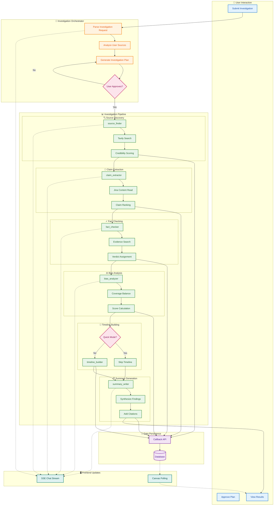
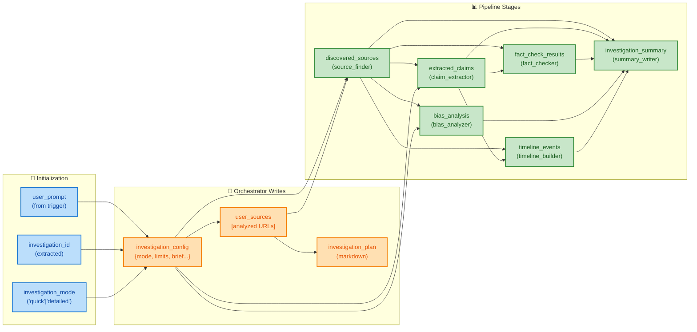

# 🔍 Vicaran Investigation Agent: Complete ADK Workflow Design

## 📋 Agent Architecture Overview

This document provides a complete implementation design for the Vicaran investigation workflow, an AI-powered research assistant for journalists. The system helps users investigate stories by gathering sources, extracting claims, fact-checking, analyzing bias, building timelines, and generating comprehensive summaries.

### **Workflow Summary**
- **Plan Generation Phase**: Root orchestrator analyzes user-provided sources and generates investigation plan
- **User Approval**: HITL checkpoint - user must approve plan before investigation starts
- **Investigation Pipeline**: Sequential execution through 6 specialized sub-agents
- **Real-time Streaming**: Progress messages streamed to chat via SSE
- **Data Persistence**: Per-stage batch saves via callback API
- **Mode-Aware Execution**: Quick Search (~10 min) vs Detailed Inquiry (~20 min)

> **🎯 Key Design Decisions**:
> - Single pipeline for both modes with configuration-driven behavior
> - Root orchestrator handles plan generation (no separate plan_generator agent)
> - No iterative refinement loop for MVP (single-pass execution)
> - Agent calls callback API directly at end of each stage
> - `timeline_builder` is skipped in Quick Search mode

---

## 🏗️ Agent Hierarchy & Configuration

### **Root Agent: Investigation Orchestrator**
- **Agent Name**: `investigation_orchestrator`
- **Agent Type**: `LlmAgent`
- **Agent Purpose**: Analyzes user sources, generates investigation plan, waits for approval, delegates to pipeline
- **Sub-agents**: `investigation_pipeline` (for approved investigation execution)
- **Tools**: `analyze_source_tool` (Jina + LLM summary), `callback_api_tool`
- **Callbacks**: `before_agent_callback=initialize_investigation_state`
- **Session State**: Reads `user_prompt`; writes `investigation_config`, `investigation_plan`, `user_sources`
- **Model**: `gemini-2.5-flash`
- **🔑 Plan Approval**: Outputs `[PLAN_APPROVAL_REQUIRED]` marker, waits for user "APPROVED" message

### **Investigation Pipeline**
- **Agent Name**: `investigation_pipeline`
- **Agent Type**: `SequentialAgent`
- **Agent Purpose**: Executes approved investigation through structured workflow stages
- **Sub-agents**: `source_finder`, `claim_extractor`, `fact_checker`, `bias_analyzer`, `timeline_builder`, `summary_writer`
- **Tools**: None (delegates to sub-agents)
- **Callbacks**: None required
- **Session State**: Processes structured investigation workflow
- **Model**: N/A (SequentialAgent)

### **Source Finder Agent**
- **Agent Name**: `source_finder`
- **Agent Type**: `LlmAgent`
- **Agent Purpose**: Discovers additional sources via web search based on investigation brief
- **Sub-agents**: None
- **Tools**: `tavily_search_tool`, `callback_api_tool`
- **Callbacks**: `after_agent_callback=batch_save_sources`
- **Session State**: Reads `investigation_config`, `user_sources`; writes `discovered_sources`
- **Model**: `gemini-2.5-flash`

### **Claim Extractor Agent**
- **Agent Name**: `claim_extractor`
- **Agent Type**: `LlmAgent`
- **Agent Purpose**: Extracts and ranks claims from all sources
- **Sub-agents**: None
- **Tools**: `jina_reader_tool`, `callback_api_tool`
- **Callbacks**: `after_agent_callback=batch_save_claims`
- **Session State**: Reads `discovered_sources`, `investigation_config`; writes `extracted_claims`
- **Model**: `gemini-2.5-flash`

### **Fact Checker Agent**
- **Agent Name**: `fact_checker`
- **Agent Type**: `LlmAgent`
- **Agent Purpose**: Verifies claims against source evidence
- **Sub-agents**: None
- **Tools**: `tavily_search_tool`, `callback_api_tool`
- **Callbacks**: `after_agent_callback=batch_save_fact_checks`
- **Session State**: Reads `extracted_claims`, `discovered_sources`; writes `fact_check_results`
- **Model**: `gemini-2.5-pro` (critical reasoning task)

### **Bias Analyzer Agent**
- **Agent Name**: `bias_analyzer`
- **Agent Type**: `LlmAgent`
- **Agent Purpose**: Analyzes bias indicators across sources
- **Sub-agents**: None
- **Tools**: `callback_api_tool`
- **Callbacks**: `after_agent_callback=batch_save_bias_scores`
- **Session State**: Reads `discovered_sources`, `investigation_config`; writes `bias_analysis`
- **Model**: `gemini-2.5-flash`

### **Timeline Builder Agent**
- **Agent Name**: `timeline_builder`
- **Agent Type**: `LlmAgent`
- **Agent Purpose**: Constructs chronological timeline from sources (SKIPPED in Quick Search mode)
- **Sub-agents**: None
- **Tools**: `callback_api_tool`
- **Callbacks**: `after_agent_callback=batch_save_timeline_events`
- **Session State**: Reads `extracted_claims`, `discovered_sources`; writes `timeline_events`
- **Model**: `gemini-2.5-flash`
- **🔑 Conditional Skip**: Instruction checks `skip_timeline` flag and returns `[TIMELINE_SKIPPED]` if true

### **Summary Writer Agent**
- **Agent Name**: `summary_writer`
- **Agent Type**: `LlmAgent`
- **Agent Purpose**: Generates final investigation summary with citations
- **Sub-agents**: None
- **Tools**: `callback_api_tool`
- **Callbacks**: `after_agent_callback=save_final_summary`
- **Session State**: Reads all previous results; writes `investigation_summary`
- **Model**: `gemini-2.5-pro` (high-quality writing)

---

## 🔗 Agent Connection Mapping

```
investigation_orchestrator (LlmAgent - Root)
├── Tools: [analyze_source_tool, callback_api_tool]
├── Callbacks: [initialize_investigation_state]
└── Sub-agents: [investigation_pipeline]
    └── investigation_pipeline (SequentialAgent)
        ├── source_finder (LlmAgent with tavily_search_tool)
        │   └── Callback: batch_save_sources
        ├── claim_extractor (LlmAgent with jina_reader_tool)
        │   └── Callback: batch_save_claims
        ├── fact_checker (LlmAgent with tavily_search_tool)
        │   └── Callback: batch_save_fact_checks
        ├── bias_analyzer (LlmAgent)
        │   └── Callback: batch_save_bias_scores
        ├── timeline_builder (LlmAgent) [CONDITIONAL - skipped in Quick mode]
        │   └── Callback: batch_save_timeline_events
        └── summary_writer (LlmAgent)
            └── Callback: save_final_summary
```

---

## � Source Processing & Real-Time Streaming

### **Design Principle: Per-Source Summarization**

> **Problem Solved:** Prevents "Lost in the Middle" phenomenon and token overflow  
> **UX Benefit:** Real-time progress updates keep user engaged

### **Why This Pattern:**
| Challenge | Solution |
|-----------|----------|
| 30 sources × 5000 chars = 150k chars | Pre-summarize to 500 chars each = 15k total |
| "Lost in the Middle" quality loss | Each source gets individual LLM attention |
| Long wait times feel slow | Per-source streaming feels fast |
| User uncertainty | User sees each source as it's analyzed |

### **Processing Flow**

```
source_finder (per-source processing):
┌─────────────────────────────────────────────────────────────────────┐
│ For each source URL:                                                │
│   1. Fetch content via Jina Reader (5000 chars)                    │
│   2. LLM summarizes to 500 chars + extracts key claims             │
│   3. Stream to chat: "📄 Analyzing source X/15: {title}..."        │
│   4. Save to DB via callback API                                   │
│   5. Store summary (NOT raw content) in session state               │
└─────────────────────────────────────────────────────────────────────┘
                              │
                              ▼
claim_extractor (receives summaries only):
┌─────────────────────────────────────────────────────────────────────┐
│ Receives: 15 source summaries (15k chars total)                    │
│ Task: Consolidate claims, dedupe, rank by importance               │
│ Output: Verified claim list with source links                      │
└─────────────────────────────────────────────────────────────────────┘
```

### **Chat Streaming Pattern (source_finder)**

**User Experience:**
```
🔍 Searching for sources on "XYZ pollution EPA investigation"...

📄 **Analyzing source 1/15:** Reuters - EPA Investigation Report
   ⭐⭐⭐⭐⭐ High credibility | reuters.com
   💡 Key finding: "EPA confirms 312% pollution limit exceedance"

📄 **Analyzing source 2/15:** City Health Department Report  
   ⭐⭐⭐⭐ Good credibility | citynews.com
   💡 Key finding: "28% increase in respiratory complaints reported"

📄 **Analyzing source 3/15:** XYZ Company Press Release
   ⭐⭐ Low credibility | xyzcorp.com
   💡 Key finding: "Company denies wrongdoing, cites technical errors"

... (continues for all sources)

✅ **All 15 sources analyzed!** 
   • 5 high-credibility sources (⭐⭐⭐⭐⭐)
   • 7 medium-credibility sources (⭐⭐⭐)  
   • 3 low-credibility sources (⭐⭐)

Proceeding to claim extraction...
```

### **Source Data Structure (Session State)**

```json
// discovered_sources now contains SUMMARIES, not raw content
[
    {
        "url": "https://reuters.com/article/xyz",
        "title": "Reuters: EPA Investigation Report",
        "domain": "reuters.com",
        "credibility_score": 5,
        "content_summary": "EPA confirms XYZ company exceeded pollution limits by 312% in Q4 2024. Enforcement action filed January 2025.",
        "key_claims": ["312% exceedance confirmed", "Enforcement action pending"],
        "is_user_provided": false,
        "is_reachable": true
    }
]
```

### **source_finder Instruction Pattern**

```python
source_finder_instruction = """
You are a Source Finder for investigative journalism.

**IMPORTANT: Process sources ONE AT A TIME with streaming output.**

For EACH source you find or analyze:

1. **Fetch Content**: Use Jina Reader to get source content
2. **Analyze & Summarize**: 
   - Generate 2-3 sentence summary (max 500 chars)
   - Extract 1-3 key claims from this source
   - Assess credibility (1-5 stars based on domain + content quality)
3. **Stream to User**: Output in this EXACT format:
   ```
   📄 **Analyzing source {N}/{total}:** {title}
      ⭐⭐⭐⭐⭐ {credibility} | {domain}
      💡 Key finding: "{most important claim}"
   ```
4. **Save via Callback**: Call callback_api_tool with SOURCE_FOUND

After ALL sources are processed, output summary:
```
✅ **All {count} sources analyzed!** 
   • {high} high-credibility sources (⭐⭐⭐⭐⭐)
   • {medium} medium-credibility sources (⭐⭐⭐)  
   • {low} low-credibility sources (⭐⭐)
```

**Token Budget**: Store summaries (500 chars max), NOT full content.
**Source Limits**: Quick mode = 15 sources, Detailed mode = 30 sources.
"""
```

### **UX Benefits**

| Aspect | User Experience |
|--------|-----------------|
| **Transparency** | User sees exactly which sources are being used |
| **Trust** | Credibility ratings build confidence |
| **Engagement** | Continuous updates prevent boredom |
| **Control** | User can assess if investigation is on track |
| **Speed perception** | Steady progress feels faster than silent processing |

---

## �📊 Session State Data Specifications

### **Critical: Exact Data Structures for Investigation Workflow**

### **🚨 IMPORTANT: Mode-Aware Configuration**
- Investigation mode (`quick` vs `detailed`) determines pipeline behavior
- Mode is extracted from user prompt and stored in session state
- All agents read mode-specific limits from `investigation_config`

---

#### **`investigation_id`** (String)
- **Created by**: Extracted from user prompt in `before_agent_callback`
- **Data Type**: String (UUID)
- **Content**: Links agent session to database investigation record
- **Example**: `"550e8400-e29b-41d4-a716-446655440000"`
- **Note**: Used in ALL callback API calls to persist data

#### **`investigation_config`** (Dictionary)
- **Created by**: `investigation_orchestrator` via `output_key`
- **Data Type**: Dictionary (structured config)
- **Content**: Mode-specific configuration for the entire pipeline
- **Example**:
```json
{
    "investigation_id": "uuid-123",
    "mode": "detailed",
    "source_limit": 30,
    "claim_limit": null,
    "skip_timeline": false,
    "bias_level": "per_source",
    "summary_depth": "comprehensive",
    "title": "Environmental Investigation",
    "brief": "Investigate claims about company XYZ pollution..."
}
```

#### **`user_sources`** (List[Dictionary])
- **Created by**: `investigation_orchestrator` after analyzing user-provided URLs via `analyze_source_tool`
- **Data Type**: List of source dictionaries
- **Content**: Pre-analyzed user sources with credibility scores (1-5 scale)
- **Example**:
```json
[
    {
        "url": "https://reuters.com/article/xyz-pollution",
        "title": "Reuters: XYZ Company Under Investigation",
        "domain": "reuters.com",
        "credibility_score": 5,
        "content_summary": "Reuters report on EPA investigation...",
        "is_user_provided": true,
        "is_reachable": true
    }
]
```

**Credibility Score Scale (1-5 integer):**
| Score | Meaning | Examples |
|-------|---------|----------|
| 1 ⭐ | Low credibility | Blogs, opinion pieces |
| 2 ⭐⭐ | Below average | Unknown sources |
| 3 ⭐⭐⭐ | Average | Standard news sites |
| 4 ⭐⭐⭐⭐ | Good | Established outlets |
| 5 ⭐⭐⭐⭐⭐ | Excellent | Reuters, AP, official sources |

#### **`investigation_plan`** (String)
- **Created by**: `investigation_orchestrator` via `output_key`
- **Data Type**: String (Markdown formatted)
- **Content**: Investigation plan shown to user for approval
- **Example**:
```markdown
## 📋 Investigation Plan

Based on your brief and the 3 sources you provided, here's my investigation plan:

**What I'll Investigate:**
- Claims about XYZ Company's environmental violations
- EPA investigation timeline and outcomes
- Community health impact allegations

**Sources I'll Gather:**
- Official EPA records and press releases
- Local news coverage from affected area
- Expert commentary on environmental compliance

**Estimated Time:** 15-20 minutes

[✅ Approve & Start] [✏️ Edit Brief]
```

#### **`discovered_sources`** (String)
- **Created by**: `source_finder` agent via `output_key`
- **Data Type**: String (agent's complete output with embedded source data)
- **Content**: Web-discovered sources with metadata
- **Example**:
```markdown
**Source Discovery Complete**

Found 18 additional sources for your investigation:

1. **EPA Enforcement Action** (epa.gov) - Credibility: 95%
   Summary: Official enforcement notice dated Jan 2024...

2. **Local News Report** (citynews.com) - Credibility: 75%
   Summary: Investigation coverage with resident interviews...

[Full source list saved to database]
```

#### **`extracted_claims`** (String)
- **Created by**: `claim_extractor` agent via `output_key`
- **Data Type**: String (agent's analysis with structured claims)
- **Content**: Ranked claims extracted from all sources
- **Example**:
```markdown
**Claim Extraction Complete**

Extracted 12 verifiable claims from 21 sources:

## Top 5 Claims (by impact):

1. **[HIGH IMPACT]** "XYZ Company exceeded pollution limits by 300% in Q4 2024"
   - Sources: EPA Report, Local News
   - Importance: 0.95

2. **[MEDIUM IMPACT]** "Community health complaints increased 40% since 2023"
   - Sources: Health Department, Resident Testimony
   - Importance: 0.82

[All claims saved to database for verification]
```

#### **`fact_check_results`** (String)
- **Created by**: `fact_checker` agent via `output_key`
- **Data Type**: String (verification analysis)
- **Content**: Fact-check verdicts with supporting evidence
- **Example**:
```markdown
**Fact-Checking Complete**

Verified 5 claims (Quick Search mode):

1. ✅ **VERIFIED** - "XYZ exceeded pollution limits by 300%"
   - Evidence: EPA enforcement document confirms 312% exceedance
   - Confidence: 0.92

2. ⚠️ **PARTIALLY TRUE** - "Community health complaints increased 40%"
   - Finding: Increase was 28%, not 40% per health dept records
   - Confidence: 0.78

[Full verification results saved to database]
```

#### **`bias_analysis`** (String)
- **Created by**: `bias_analyzer` agent via `output_key`
- **Data Type**: String (bias assessment)
- **Content**: Bias scores (0-10 scale) and indicators
- **Example (Quick mode - overall only)**:
```markdown
**Bias Analysis Complete**

**Overall Investigation Bias Score: 3.5/10** (Low-Moderate)

**Coverage Balance:**
- Pro-company sources: 3 (14%)
- Neutral sources: 12 (57%)
- Critical sources: 6 (29%)

**Recommendation:** Consider adding industry perspective sources.
```

**Bias Score Scale (0-10 number):**
| Range | Meaning |
|-------|-------|
| 0-2 | Low bias (balanced) |
| 2-4 | Low-moderate bias |
| 4-6 | Moderate bias |
| 6-8 | High bias |
| 8-10 | Very high bias (one-sided) |

#### **`timeline_events`** (String)
- **Created by**: `timeline_builder` agent via `output_key` (SKIPPED in Quick mode)
- **Data Type**: String (chronological timeline)
- **Content**: Key events with dates and source links
- **Example**:
```markdown
**Timeline Constructed**

## Investigation Timeline: XYZ Environmental Case

| Date | Event | Sources |
|------|-------|---------|
| Mar 2023 | First resident complaints filed | Local News, Health Dept |
| Jun 2023 | EPA begins preliminary investigation | EPA Records |
| Oct 2023 | XYZ files response denying violations | Company Filing |
| Jan 2024 | EPA issues enforcement notice | EPA, Reuters |
| Feb 2024 | Community health study launched | Health Dept |

[Timeline events saved to database]
```

#### **`investigation_summary`** (String)
- **Created by**: `summary_writer` agent via `output_key`
- **Data Type**: String (Markdown formatted with citations)
- **Content**: Final investigation summary
- **Example**:
```markdown
# Investigation Summary: XYZ Environmental Violations

## Executive Summary
This investigation examined claims of environmental violations by XYZ Company...

## Key Findings
1. **Confirmed**: EPA records verify pollution limit exceedances [1]
2. **Partially Confirmed**: Health impact claims require additional verification [2]
3. **Unverified**: Company response claims insufficient monitoring [3]

## Bias Assessment
Overall bias score: 0.35 (Low-Moderate). Coverage slightly favors critical sources.

## Recommendations
- Follow up with state environmental agency for additional records
- Interview affected community members directly

## Sources
[1] https://epa.gov/enforcement/xyz-notice
[2] https://citynews.com/xyz-health-study
[3] https://xyz-company.com/response
```

---

### **State Access Patterns for This Workflow**

**Session State Flow:**
```
investigation_orchestrator
    └─ writes: investigation_config, user_sources, investigation_plan
           │
           ▼ (after user approval)
    source_finder
        └─ reads: investigation_config, user_sources
        └─ writes: discovered_sources
               │
               ▼
    claim_extractor
        └─ reads: discovered_sources, investigation_config
        └─ writes: extracted_claims
               │
               ▼
    fact_checker
        └─ reads: extracted_claims, discovered_sources
        └─ writes: fact_check_results
               │
               ▼
    bias_analyzer
        └─ reads: discovered_sources, investigation_config
        └─ writes: bias_analysis
               │
               ▼
    timeline_builder (CONDITIONAL)
        └─ reads: extracted_claims, discovered_sources
        └─ writes: timeline_events
               │
               ▼
    summary_writer
        └─ reads: ALL previous state keys
        └─ writes: investigation_summary
```

---

## 📊 Mode Configuration Reference

| Aspect | Quick Search | Detailed Inquiry |
|--------|--------------|------------------|
| `source_limit` | 15 | 30 |
| `claim_limit` | 5 (top only) | null (all) |
| `skip_timeline` | true | false |
| `bias_level` | "overall" | "per_source" |
| `summary_depth` | "brief" | "comprehensive" |
| **Estimated Time** | ~10 minutes | ~20 minutes |

---

## 🔧 Callback Implementations

### **🛠️ analyze_source_tool Specification**
```python
import httpx
from urllib.parse import urlparse, urlunparse

# 🚨 Blocked content indicators
BLOCKED_CONTENT_INDICATORS = [
    "403 forbidden", "access denied", "please enable javascript",
    "captcha", "rate limit", "cloudflare", "robot check",
    "too many requests", "blocked", "unavailable", "404 not found"
]

def is_blocked_content(content: str) -> bool:
    """Check if content indicates a blocked/failed fetch."""
    if not content or len(content.strip()) < 200:
        return True
    content_lower = content.lower()[:500]  # Check first 500 chars
    return any(indicator in content_lower for indicator in BLOCKED_CONTENT_INDICATORS)

def analyze_source_tool(url: str) -> dict:
    """Analyze a user-provided URL before plan generation.
    
    Flow:
    1. Fetch content via Jina Reader (r.jina.ai/{url})
    2. Check for blocked content
    3. LLM generates brief summary
    4. Extract domain info
    
    Args:
        url: User-provided URL to analyze
        
    Returns:
        Source analysis dict for session state
    """
    domain = urlparse(url).netloc
    
    # Fetch content via Jina Reader (no API key needed)
    jina_url = f"https://r.jina.ai/{url}"
    
    try:
        response = httpx.get(jina_url, timeout=30)
        content = response.text[:5000]  # Limit for LLM
        
        # 🚨 Check for blocked/error content
        if is_blocked_content(content):
            return {
                "url": url,
                "domain": domain,
                "is_reachable": False,
                "error": "Content blocked or unavailable",
                "credibility_score": 0,
                "is_user_provided": True
            }
        
        is_reachable = True
    except Exception:
        content = ""
        is_reachable = False
    
    # Domain-based credibility (simple lookup for MVP)
    TRUSTED_DOMAINS = {
        "reuters.com": 5, "apnews.com": 5, "bbc.com": 5,
        "nytimes.com": 4, "washingtonpost.com": 4, "theguardian.com": 4,
        "cnn.com": 3, "foxnews.com": 3, "msnbc.com": 3,
    }
    credibility = TRUSTED_DOMAINS.get(domain, 3)  # Default 3 for unknown
    
    return {
        "url": url,
        "title": "",  # Will be extracted from content
        "content_summary": "",  # Will be generated by LLM
        "domain": domain,
        "credibility_score": credibility,  # 1-5 integer
        "is_user_provided": True,
        "is_reachable": is_reachable,
        "raw_content": content  # For LLM to summarize
    }
```

---

## 🔧 URL Normalization Helper

> **Problem Solved:** Prevents claim-source linking failures due to trailing slashes, www prefixes, etc.

```python
from urllib.parse import urlparse, urlunparse

def normalize_url(url: str) -> str:
    """Normalize URL for reliable matching.
    
    Handles:
    - Trailing slashes: reuters.com/article/ → reuters.com/article
    - www prefix: www.bbc.com → bbc.com
    - Case differences: HTTP://Example.COM → http://example.com
    - Missing scheme: bbc.com/news → https://bbc.com/news
    """
    if not url:
        return ""
    
    # Add scheme if missing
    if not url.startswith(('http://', 'https://')):
        url = 'https://' + url
    
    parsed = urlparse(url.lower())  # Lowercase everything
    
    # Rebuild with normalized parts
    normalized = urlunparse((
        parsed.scheme,
        parsed.netloc.replace('www.', ''),  # Remove www
        parsed.path.rstrip('/'),            # Remove trailing slash
        '',  # params
        '',  # query (could keep this if needed)
        ''   # fragment
    ))
    
    return normalized
```

**Usage in batch_save_claims:**
```python
for source_url in claim.get("source_urls", []):
    normalized_claim_url = normalize_url(source_url)
    for s in source_id_map:
        if normalize_url(s["url"]) == normalized_claim_url:
            source_ids.append(s["source_id"])
            break  # Found match
```

---

## 🛡️ Guard Clauses for Empty Input

> **Problem Solved:** Prevents LLM from hallucinating claims when sources are empty

### Agent Instruction Pattern
Each agent checks for empty input before proceeding:

```python
claim_extractor_instruction = """
...
**FIRST - CHECK FOR EMPTY INPUT:**

Check discovered_sources from session state.

If discovered_sources is EMPTY or contains no valid sources:
- DO NOT attempt to extract claims
- DO NOT invent or hallucinate any claims
- Respond ONLY with: "[NO_CLAIMS_EXTRACTED] No sources available for claim extraction."
- Your work is complete.

**IF sources exist, proceed with claim extraction:**
[rest of instruction...]
"""
```

### Output Markers for Empty Cases
| Agent | Empty Check | Output Marker |
|-------|-------------|---------------|
| `source_finder` | No search results | `[NO_SOURCES_FOUND]` |
| `claim_extractor` | No sources | `[NO_CLAIMS_EXTRACTED]` |
| `fact_checker` | No claims | `[NO_CLAIMS_TO_VERIFY]` |
| `bias_analyzer` | No sources | `[BIAS_SKIPPED]` |
| `timeline_builder` | Quick mode or no data | `[TIMELINE_SKIPPED]` |

### Callback Detection
```python
def check_pipeline_status(callback_context: CallbackContext) -> None:
    """Check if pipeline should terminate due to no data."""
    
    output = callback_context.output
    
    # Detect early termination markers
    if any(marker in output for marker in [
        "[NO_SOURCES_FOUND]",
        "[NO_CLAIMS_EXTRACTED]"
    ]):
        # Send INVESTIGATION_PARTIAL with reason
        callback_api_tool(
            investigation_id=callback_context.state.get("investigation_id"),
            callback_type="INVESTIGATION_PARTIAL",
            data={
                "summary": "Investigation could not be completed fully.",
                "partial_reason": "Insufficient data for complete analysis"
            }
        )
```

---

## 🎯 Plan Approval Mechanism

### **Frontend Detection Markers**
The orchestrator outputs special markers that the frontend detects:

| Marker | Meaning | Frontend Action |
|--------|---------|-----------------|
| `[PLAN_APPROVAL_REQUIRED]` | Plan ready for review | Show Approve/Edit buttons |
| `[INVESTIGATION_STARTED]` | Pipeline executing | Show progress, disable chat input |
| `[INVESTIGATION_COMPLETE]` | Investigation done | Re-enable chat, show results |
| `[TIMELINE_SKIPPED]` | Quick mode skipped timeline | No action needed |

### **Orchestrator Plan Approval Instruction**
```python
orchestrator_instruction = """
You are a Vicaran Investigation Orchestrator helping journalists investigate stories.

**PHASE 1: CONTEXT GATHERING**
1. Parse the user's investigation brief from their message
2. Identify any URLs they provided
3. Use `analyze_source_tool` on each URL to get content summaries
4. Store analyzed sources in session state

**PHASE 2: PLAN GENERATION**
Generate an investigation plan in this EXACT format:

```markdown
## 📋 Investigation Plan

Based on your brief and the {count} sources you provided, here's my investigation plan:

**Investigation Topic:** {extracted topic}

**What I'll Investigate:**
- {key question 1}
- {key question 2}
- {key question 3}

**Sources I'll Gather:**
- {source category 1}
- {source category 2}

**Your sources analyzed:**
{list each user source with credibility score}

**Mode:** {Quick Search / Detailed Inquiry}
**Estimated Time:** {10-20 minutes based on mode}
```

**CRITICAL:** After the plan, ALWAYS output on a new line:
[PLAN_APPROVAL_REQUIRED]

**PHASE 3: WAIT FOR USER RESPONSE**
- If user says "APPROVED", "Start", "Yes", or "Go":
  - Output: "[INVESTIGATION_STARTED]"
  - Call callback_api_tool with INVESTIGATION_STARTED to set status = "in_progress"
  - Delegate to `investigation_pipeline`
- If user provides an edited brief or asks for changes:
  - Regenerate the plan with their updates
  - Output [PLAN_APPROVAL_REQUIRED] again
- If user wants a COMPLETELY DIFFERENT topic:
  - Respond: "It sounds like you want to investigate a different topic. Would you like to start a new investigation for that?"
  - Do NOT regenerate the plan for a different topic
  - One investigation = one topic

**NEVER** proceed to investigation_pipeline without explicit user approval.
"""
```

---

## ⏭️ Timeline Skip Instruction Pattern

### **Timeline Builder Conditional Skip**
```python
timeline_builder_instruction = """
You are a Timeline Builder analyzing investigation sources to construct a chronological timeline.

**FIRST - CHECK SKIP FLAG:**
Check the investigation_config from session state:

If `{investigation_config}` contains `"skip_timeline": true`:
- Respond ONLY with: "[TIMELINE_SKIPPED] Quick Search mode - timeline construction disabled."
- Do NOT process any sources or extract dates.
- Do NOT call any tools.
- Your work is complete.

**IF skip_timeline is false, proceed with timeline construction:**

[rest of timeline instruction here...]
"""
```

### **Callback Detection for Skip**
```python
def batch_save_timeline_events(callback_context: CallbackContext) -> None:
    """Save timeline events, but skip if agent returned TIMELINE_SKIPPED."""
    
    timeline_output = callback_context.state.get("timeline_events", "")
    
    # Detect skip marker - no DB writes needed
    if "[TIMELINE_SKIPPED]" in timeline_output:
        return  # Nothing to save
    
    # Otherwise, parse and save timeline events...
    investigation_id = callback_context.state.get("investigation_id")
    events = parse_timeline_from_output(timeline_output)
    
    for event in events:
        callback_api_tool(
            investigation_id=investigation_id,
            callback_type="TIMELINE_EVENT",
            data={
                "event_date": event["date"],  # ISO 8601 format
                "event_text": event["description"],
                "source_id": event.get("source_id")  # Optional
            }
        )
```

---

## 🆕 INVESTIGATION_PARTIAL Callback Type

> **Note:** This callback type needs to be added to the existing API for graceful degradation.

```typescript
// Add to apps/web/app/api/agent-callback/route.ts

const investigationPartialSchema = z.object({
    type: z.literal("INVESTIGATION_PARTIAL"),
    investigation_id: z.string().uuid(),
    data: z.object({
        summary: z.string(),
        overall_bias_score: z.number().min(0).max(5).optional(),
        partial_reason: z.string(),  // e.g., "3 sources failed to load"
    }),
});

// Handler:
case "INVESTIGATION_PARTIAL": {
    const payload = investigationPartialSchema.parse(body);
    
    await db
        .update(investigations)
        .set({
            status: "partial",  // New status between "completed" and "failed"
            summary: payload.data.summary,
            overall_bias_score: payload.data.overall_bias_score?.toFixed(2),
            updated_at: new Date(),
        })
        .where(eq(investigations.id, payload.investigation_id));
    
    return NextResponse.json({ success: true });
}
```

---
### **State Initialization Callback**
```python
from google.adk.agents.callback_context import CallbackContext
import re

def initialize_investigation_state(callback_context: CallbackContext) -> None:
    """Initialize all required state keys for the investigation workflow.
    
    Extracts investigation_id and mode from the user prompt.
    """
    session_state = callback_context._invocation_context.session.state
    user_prompt = session_state.get("user_prompt", "")
    
    # Extract investigation_id from prompt (format: "Investigation ID: uuid")
    id_match = re.search(r'Investigation ID:\s*([a-f0-9-]+)', user_prompt, re.IGNORECASE)
    if id_match:
        session_state["investigation_id"] = id_match.group(1)
    
    # Extract mode from prompt
    mode = "quick" if "quick" in user_prompt.lower() else "detailed"
    
    # Initialize with mode-specific defaults
    session_state["investigation_mode"] = mode
    session_state["investigation_config"] = {}
    session_state["user_sources"] = []
    session_state["investigation_plan"] = ""
    session_state["discovered_sources"] = ""
    session_state["extracted_claims"] = ""
    session_state["fact_check_results"] = ""
    session_state["bias_analysis"] = ""
    session_state["timeline_events"] = ""
    session_state["investigation_summary"] = ""
```

### **Callback API Tool**
```python
from google.adk.tools import FunctionTool
import httpx
import os

def callback_api_tool(
    investigation_id: str,
    callback_type: str,
    data: dict
) -> dict:
    """Send data to the Next.js callback API for database persistence.
    
    Args:
        investigation_id: UUID of the investigation in the database
        callback_type: Type of callback (SOURCE_FOUND, CLAIM_EXTRACTED, etc.)
        data: Structured data payload for the callback
        
    Returns:
        API response with success status and created ID (source_id, claim_id, etc.)
    """
    api_url = os.getenv("CALLBACK_API_URL", "http://localhost:3000/api/agent-callback")
    api_secret = os.getenv("AGENT_SECRET")
    
    # ⚠️ API expects 'type' not 'callback_type'
    payload = {
        "type": callback_type,  # Field name must be 'type' to match API
        "investigation_id": investigation_id,
        "data": data
    }
    
    # ⚠️ Use X-Agent-Secret header to match existing API
    headers = {
        "Content-Type": "application/json",
        "X-Agent-Secret": api_secret  # NOT "Authorization: Bearer"
    }
    
    # 🛠️ DEBUG MODE - Enable with DEBUG_MODE=true in .env
    if os.getenv("DEBUG_MODE") == "true":
        print(f"\n🚀 CALLBACK FIRED: {callback_type}")
        print(f"🆔 Investigation ID: {investigation_id}")
        print(f"📦 PAYLOAD: {str(data)[:200]}...")  # Truncate for readability
    
    try:
        response = httpx.post(api_url, json=payload, headers=headers, timeout=30)
        response.raise_for_status()
        result = response.json()
        
        # 🛠️ DEBUG: Log response
        if os.getenv("DEBUG_MODE") == "true":
            print(f"✅ RESPONSE: {result}")
        
        # API returns created IDs: source_id, claim_id, fact_check_id, event_id
        return {"success": True, **result}
    except Exception as e:
        if os.getenv("DEBUG_MODE") == "true":
            print(f"❌ ERROR: {str(e)}")
        return {"success": False, "error": str(e)}
```

### **🔑 Critical: ID Propagation Pattern**

The callback API returns database IDs that downstream agents need:
- `SOURCE_FOUND` → returns `source_id`
- `CLAIM_EXTRACTED` → returns `claim_id`
- `FACT_CHECKED` → returns `fact_check_id`
- `TIMELINE_EVENT` → returns `event_id`

These IDs must be stored in session state so `fact_checker` can reference `claim_id` and `source_id`.

### **Batch Save Sources (with ID storage)**
```python
def batch_save_sources(callback_context: CallbackContext) -> None:
    """After source_finder completes, save sources and store IDs for fact_checker."""
    
    investigation_id = callback_context.state.get("investigation_id")
    discovered_sources = callback_context.state.get("discovered_sources", "")
    
    sources = parse_sources_from_output(discovered_sources)
    source_ids = []  # Store for downstream use
    
    for source in sources:
        result = callback_api_tool(
            investigation_id=investigation_id,
            callback_type="SOURCE_FOUND",
            data={
                "url": source["url"],
                "title": source.get("title"),
                "content_snippet": source.get("content_snippet"),
                "credibility_score": source.get("credibility_score"),  # 1-5 integer
                "is_user_provided": source.get("is_user_provided", False)
            }
        )
        if result.get("source_id"):
            source_ids.append({
                "url": source["url"],
                "source_id": result["source_id"]
            })
    
    # 🔑 Store IDs in session state for fact_checker
    callback_context.state["source_id_map"] = source_ids

### **Batch Save Claims (with ID storage for fact_checker)**
```python
def batch_save_claims(callback_context: CallbackContext) -> None:
    """Save claims and store claim_ids for fact_checker to reference."""
    
    investigation_id = callback_context.state.get("investigation_id")
    extracted_claims = callback_context.state.get("extracted_claims", "")
    source_id_map = callback_context.state.get("source_id_map", [])
    
    claims = parse_claims_from_output(extracted_claims)
    claim_ids = []  # Store for fact_checker
    
    for claim in claims:
        # Map source URLs to database IDs using normalized URLs
        source_ids = []
        for source_url in claim.get("source_urls", []):
            normalized_claim_url = normalize_url(source_url)
            for s in source_id_map:
                if normalize_url(s["url"]) == normalized_claim_url:
                    source_ids.append(s["source_id"])
                    break  # Found match, no need to continue
        
        result = callback_api_tool(
            investigation_id=investigation_id,
            callback_type="CLAIM_EXTRACTED",
            data={
                "claim_text": claim["claim_text"],
                "source_ids": source_ids  # Link to sources in DB
            }
        )
        if result.get("claim_id"):
            claim_ids.append({
                "claim_text": claim["claim_text"],
                "claim_id": result["claim_id"],
                "source_ids": source_ids
            })
    
    # 🔑 Store claim_ids for fact_checker
    callback_context.state["claim_id_map"] = claim_ids
```

---

## 📡 Integration Points

### **Streaming to Chat (SSE)**
The ADK agent streams progress messages directly to the browser via SSE:

```python
# In agent instructions, include progress markers:
instruction = """
...
When starting each phase, output a progress message in this format:
🔍 [PROGRESS] Searching for sources related to: {query}
✅ [PROGRESS] Found {count} sources. Analyzing credibility...
📝 [PROGRESS] Extracting claims from {count} sources...
...
"""
```

These markers are rendered in the chat UI in real-time.

---

## 💬 Chat Message Format Specifications

### **Message Count per Stage**

| Stage | Agent | Messages | Purpose |
|-------|-------|----------|---------|
| 1. Plan Generation | `orchestrator` | 1 | Investigation plan + `[PLAN_APPROVAL_REQUIRED]` |
| 2. User Approval | User | 1 | "APPROVED" / edited brief |
| 3. Pipeline Start | `orchestrator` | 1 | `[INVESTIGATION_STARTED]` |
| 4. Source Discovery | `source_finder` | 3-5 | Search progress + results |
| 5. Claim Extraction | `claim_extractor` | 2-3 | Extraction progress + summary |
| 6. Fact Checking | `fact_checker` | 3-5 | Per-claim verification |
| 7. Bias Analysis | `bias_analyzer` | 1-2 | Analysis summary |
| 8. Timeline | `timeline_builder` | 1 | Timeline or `[TIMELINE_SKIPPED]` |
| 9. Summary | `summary_writer` | 1 | Final summary + `[INVESTIGATION_COMPLETE]` |

**Total: ~15-20 messages** for typical investigation

---

### **Message Format Examples**

#### **1. Plan Generation (Orchestrator)**
```markdown
## 📋 Investigation Plan

Based on your brief and the 3 sources you provided, here's my investigation plan:

**Investigation Topic:** XYZ Company Environmental Violations

**What I'll Investigate:**
- EPA enforcement records and timeline
- Community health impact claims
- Company response and compliance history

**Sources I'll Gather:**
- Official EPA records and press releases
- Local news coverage from affected area
- Expert commentary on environmental compliance

**Your sources analyzed:**
- ⭐⭐⭐⭐⭐ Reuters: XYZ Company Under Investigation
- ⭐⭐⭐⭐ Local News: Community Health Concerns

**Mode:** Detailed Inquiry
**Estimated Time:** 15-20 minutes

[PLAN_APPROVAL_REQUIRED]
```

#### **2. Pipeline Start (Orchestrator)**
```
[INVESTIGATION_STARTED]

Starting investigation pipeline. You'll see progress updates below as I work through each stage.
```

#### **3. Source Discovery (source_finder)**
```
🔍 [PROGRESS] Searching for sources on: "XYZ company EPA enforcement 2024"

🔍 [PROGRESS] Searching for sources on: "XYZ pollution community health impact"

✅ [PROGRESS] Found 18 relevant sources. Analyzing credibility...

📊 [PROGRESS] Source analysis complete:
• 5 high-credibility sources (⭐⭐⭐⭐⭐)
• 9 medium-credibility sources (⭐⭐⭐)
• 4 low-credibility sources (⭐⭐)

All sources saved to your dashboard.
```

#### **4. Claim Extraction (claim_extractor)**
```
📝 [PROGRESS] Extracting claims from 21 sources...

✅ [PROGRESS] Extracted 12 verifiable claims. Top claims by importance:

1. **[HIGH]** "XYZ exceeded pollution limits by 300% in Q4 2024"
   Sources: EPA Report, Reuters
   
2. **[MEDIUM]** "Community health complaints increased 40% since 2023"
   Sources: Health Department, Local News

3. **[MEDIUM]** "EPA investigation began in June 2023"
   Sources: EPA Records

All claims saved for verification.
```

#### **5. Fact Checking (fact_checker)**
```
🔎 [PROGRESS] Verifying claim 1/5: "XYZ exceeded pollution limits by 300%"

✅ **VERIFIED** - EPA enforcement document confirms 312% exceedance
   Confidence: 92%

🔎 [PROGRESS] Verifying claim 2/5: "Community health complaints increased 40%"

⚠️ **PARTIALLY TRUE** - Health dept records show 28% increase, not 40%
   Confidence: 78%

🔎 [PROGRESS] Verifying claim 3/5: "EPA investigation began in June 2023"

✅ **VERIFIED** - EPA timeline confirms investigation start date
   Confidence: 95%

Fact-check results saved to dashboard.
```

#### **6. Bias Analysis (bias_analyzer)**
```
⚖️ [PROGRESS] Analyzing source coverage balance...

📊 **Bias Analysis Complete**

**Overall Score: 3.5/10** (Low-Moderate Bias)

Coverage breakdown:
• Pro-company: 3 sources (14%)
• Neutral: 12 sources (57%)  
• Critical: 6 sources (29%)

💡 Recommendation: Consider adding industry perspective for balance.
```

#### **7. Timeline (timeline_builder)**

**If Detailed Mode:**
```
📅 [PROGRESS] Constructing timeline from sources...

**Timeline: XYZ Environmental Case**

| Date | Event |
|------|-------|
| Mar 2023 | First resident complaints filed |
| Jun 2023 | EPA begins preliminary investigation |
| Oct 2023 | XYZ files response denying violations |
| Jan 2024 | EPA issues enforcement notice |
| Feb 2024 | Community health study launched |

Timeline saved to dashboard.
```

**If Quick Mode:**
```
[TIMELINE_SKIPPED] Quick Search mode - timeline construction disabled.
```

#### **8. Final Summary (summary_writer)**
```markdown
# Investigation Summary: XYZ Environmental Violations

## Executive Summary
This investigation examined claims of environmental violations by XYZ Company, focusing on pollution limit exceedances and community health impacts. Based on analysis of 21 sources, including official EPA records and local news coverage, key findings are documented below.

## Key Findings
1. ✅ **Confirmed**: EPA records verify pollution limit exceedances of 312% [1]
2. ⚠️ **Partially Confirmed**: Health complaints increased 28%, not 40% as claimed [2]
3. ❓ **Unverified**: Claims of company prior knowledge require further investigation [3]

## Bias Assessment
Overall bias score: 3.5/10 (Low-Moderate)
Coverage slightly favors critical sources. Consider industry commentary for balance.

## Recommendations
- Follow up with state environmental agency for additional records
- Request formal interview with XYZ Company spokesperson
- Monitor ongoing community health study results

## Sources
[1] EPA Enforcement Notice #2024-1234 - epa.gov
[2] City Health Department Report - citynews.com
[3] Anonymous source (unverified) - N/A

[INVESTIGATION_COMPLETE]
```

---

### **Visual Chat Flow**
```
┌──────────────────────────────────────────────────────────────────┐
│ Chat                                                             │
├──────────────────────────────────────────────────────────────────┤
│ 👤 User: Investigate XYZ Company pollution claims...             │
│                                                                  │
│ 🤖 ## 📋 Investigation Plan                                      │
│    [plan details...]                                             │
│    [PLAN_APPROVAL_REQUIRED]                                      │
│                                                                  │
│ 👤 APPROVED                                                      │
│                                                                  │
│ 🤖 [INVESTIGATION_STARTED]                                       │
│                                                                  │
│ 🤖 🔍 Searching for sources on: "XYZ EPA enforcement"...        │
│                                                                  │
│ 🤖 ✅ Found 18 sources. Analyzing credibility...                 │
│                                                                  │
│ 🤖 📝 Extracting claims from 21 sources...                       │
│                                                                  │
│ 🤖 🔎 Verifying claim 1/5...                                     │
│                                                                  │
│ 🤖 ✅ VERIFIED - 312% pollution exceedance confirmed             │
│                                                                  │
│ 🤖 ⚖️ Analyzing source coverage balance...                       │
│                                                                  │
│ 🤖 📅 Constructing timeline...                                   │
│                                                                  │
│ 🤖 # Investigation Summary: XYZ Environmental...                 │
│    [full summary with citations]                                 │
│    [INVESTIGATION_COMPLETE]                                      │
└──────────────────────────────────────────────────────────────────┘
```

### **Canvas Polling (Dashboard Tabs)**
The Next.js frontend polls for data updates:

```typescript
// React Query polling every 3 seconds
const { data: investigation } = useQuery({
    queryKey: ['investigation', investigationId],
    queryFn: () => fetchInvestigation(investigationId),
    refetchInterval: 3000,  // Poll while investigation is active
    enabled: investigation?.status === 'in_progress'
});
```

---

## 🏗️ Project Structure

```
apps/vicaran-agent/
├── __init__.py                     # Export: from .agent import root_agent
├── agent.py                        # Root orchestrator definition
├── config.py                       # Model and API configurations
├── models.py                       # Pydantic models (if needed)
├── callbacks.py                    # Callback implementations
├── sub_agents/
│   ├── __init__.py
│   ├── source_finder/
│   │   └── agent.py               # Source discovery agent
│   ├── claim_extractor/
│   │   └── agent.py               # Claim extraction agent
│   ├── fact_checker/
│   │   └── agent.py               # Fact verification agent
│   ├── bias_analyzer/
│   │   └── agent.py               # Bias analysis agent
│   ├── timeline_builder/
│   │   └── agent.py               # Timeline construction agent
│   └── summary_writer/
│       └── agent.py               # Summary generation agent
├── tools/
│   ├── __init__.py
│   ├── tavily_search.py           # Tavily search integration
│   ├── jina_reader.py             # Jina URL content extraction
│   └── callback_api.py            # Callback API tool
└── prompts/
    ├── orchestrator.py            # Root agent instruction
    ├── source_finder.py           # Source finder instruction
    ├── claim_extractor.py         # Claim extractor instruction
    ├── fact_checker.py            # Fact checker instruction
    ├── bias_analyzer.py           # Bias analyzer instruction
    ├── timeline_builder.py        # Timeline builder instruction
    └── summary_writer.py          # Summary writer instruction
```

---

## 🎯 Architecture Highlights

### **✅ Design Decisions for MVP:**
- **Single-pass pipeline**: No iterative refinement loop - simpler and faster
- **Root handles planning**: Plan generation in orchestrator, not separate agent
- **Mode via session state**: Clean configuration passing between agents
- **Per-stage batch saves**: Simpler callback logic, better UX
- **Conditional timeline**: Skip entire agent in Quick mode
- **Direct SSE streaming**: Chat updates via ADK's built-in streaming

### **✅ Error Handling Strategy:**
- **Continue with degraded quality**: Mark partial results, don't stop pipeline
- **Per-source failures**: Skip failed source, continue with others
- **Stage failures**: Mark investigation as "partial", continue to next stage
- **Critical failures only**: Stop if zero sources found or DB completely fails

### **✅ User Experience Features:**
- **Plan approval**: Shows transparency, builds trust
- **Detailed progress**: Per-action chat updates (each search query, each source)
- **Mode options**: Quick for speed, Detailed for thoroughness
- **Citations in summary**: Inline source references with URLs

---

## 📋 Implementation Checklist

### **Build Order: Follow Execution Flow**

- [ ] **Build Project Structure & Configuration**
  - [ ] Create `apps/vicaran-agent/` directory structure
  - [ ] Set up `pyproject.toml` with ADK dependencies
  - [ ] Configure environment variables (API keys)
  - [ ] Create `config.py` with model configurations

- [ ] **Build `investigation_orchestrator`** (LlmAgent - Root Agent)
  - [ ] Implement `initialize_investigation_state` callback
  - [ ] Create `analyze_source_tool` for URL analysis
  - [ ] Set up `sub_agents=[investigation_pipeline]`
  - [ ] Set `output_key="investigation_plan"`
  - [ ] Write comprehensive instruction for planning phase
  - [ ] Test plan generation and user interaction

- [ ] **Build `investigation_pipeline`** (SequentialAgent)
  - [ ] Configure sub_agents list with all 6 agents
  - [ ] Handle mode-based conditional execution (skip timeline)
  - [ ] Test sequential flow coordination

- [ ] **Build `source_finder`** (LlmAgent)
  - [ ] Implement `tavily_search_tool` integration
  - [ ] Set up `batch_save_sources` callback
  - [ ] Configure mode-aware source limits
  - [ ] Set `output_key="discovered_sources"`
  - [ ] Write instruction for web search and credibility scoring

- [ ] **Build `claim_extractor`** (LlmAgent)
  - [ ] Implement `jina_reader_tool` for content extraction
  - [ ] Set up `batch_save_claims` callback
  - [ ] Configure mode-aware claim limits (top 5 vs all)
  - [ ] Set `output_key="extracted_claims"`
  - [ ] Write instruction for claim extraction and ranking

- [ ] **Build `fact_checker`** (LlmAgent)
  - [ ] Configure model as `gemini-2.5-pro`
  - [ ] Set up `batch_save_fact_checks` callback
  - [ ] Set `output_key="fact_check_results"`
  - [ ] Write instruction for verification logic

- [ ] **Build `bias_analyzer`** (LlmAgent)
  - [ ] Set up `batch_save_bias_scores` callback
  - [ ] Configure mode-aware bias level (overall vs per-source)
  - [ ] Set `output_key="bias_analysis"`
  - [ ] Write instruction for bias detection

- [ ] **Build `timeline_builder`** (LlmAgent)
  - [ ] Implement conditional skip logic for Quick mode
  - [ ] Set up `batch_save_timeline_events` callback
  - [ ] Set `output_key="timeline_events"`
  - [ ] Write instruction for timeline construction

- [ ] **Build `summary_writer`** (LlmAgent)
  - [ ] Configure model as `gemini-2.5-pro`
  - [ ] Set up `save_final_summary` callback
  - [ ] Set `output_key="investigation_summary"`
  - [ ] Write instruction for citation-rich summary generation

### **Supporting Components:**

- [ ] **Implement Tools**
  - [ ] `tavily_search_tool` with rate limiting
  - [ ] `jina_reader_tool` for URL content
  - [ ] `callback_api_tool` for database persistence
  - [ ] `analyze_source_tool` for user URL analysis

- [ ] **Implement Callbacks**
  - [ ] `initialize_investigation_state`
  - [ ] `batch_save_sources`
  - [ ] `batch_save_claims`
  - [ ] `batch_save_fact_checks`
  - [ ] `batch_save_bias_scores`
  - [ ] `batch_save_timeline_events`
  - [ ] `save_final_summary`

### **Final Integration:**

- [ ] **Test Complete Workflow End-to-End**
  - [ ] Test Quick Search mode (skip timeline, top 5 claims)
  - [ ] Test Detailed Inquiry mode (full pipeline)
  - [ ] Verify callback API persistence
  - [ ] Test SSE streaming to chat
  - [ ] Verify dashboard polling updates

- [ ] **Validate Session State Flow**
  - [ ] Confirm all `output_key` → `{placeholder}` connections
  - [ ] Test state initialization callback
  - [ ] Verify mode configuration propagates correctly

---

## 📐 Mermaid Diagram: Agent Workflow



---

## 📐 Mermaid Diagram: Session State Flow



---

*Document Version: 1.0*  
*Created: February 2026*  
*Last Updated: February 2026*  
*Focus: MVP Implementation for Hackathon (February 10, 2026 deadline)*
